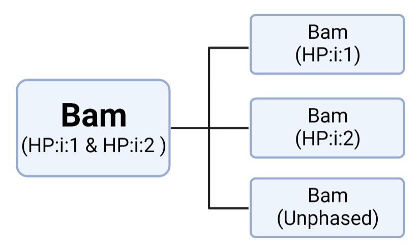

# Split haplotype BAM by haplotag 
Split Bam file in to three isolated bam by using Haplotype tags (HP:i:1 or HP:i:2)<br>


There are two step:<br>
(1) Divide Input-Bam into 3 files:<br>
 		'Haplotype 1 Bam'--'1.0.bam'<br>
 		'Haplotype 2 Bam'--'2.0.bam'<br>
		'Unphased Bam'   --'0.0.bam'<br>
(2) Index and Sort 3 new Bam files (Require samtools env)<br>

<br>

## Proactive
Example:
```sh
conda create -n py39 -c bioconda python=3.9.13 pysam==0.19.1
conda activate py39
```
## Usage

This generator requires [pysam](https://pysam.readthedocs.io/en/latest/installation.html), [samtools](http://www.htslib.org/download/) when use it in HPC.

You can simply run it by using this script:

```sh
python3 Split_bam_into_HP.py -b my.bam -hp HP
```

You can Specify the output file name and output folder:
```sh
python3 Split_bam_into_HP.py -b my.bam -hp HP -o1 new_HP_1.bam -o2 new_HP_2.bam  -o3 new_noHP.bam -d /outputdirection/
```


### Note

This small tool adapts to duel with bam file which added 'HP:i' tags by [longshot](https://github.com/pjedge/longshot/), [longphase](https://github.com/twolinin/longphase/)， etc..
